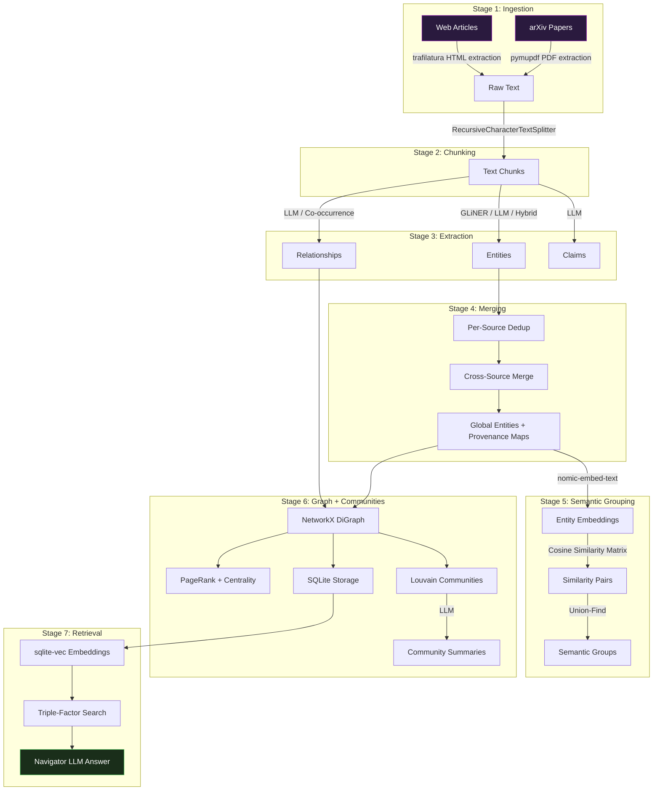
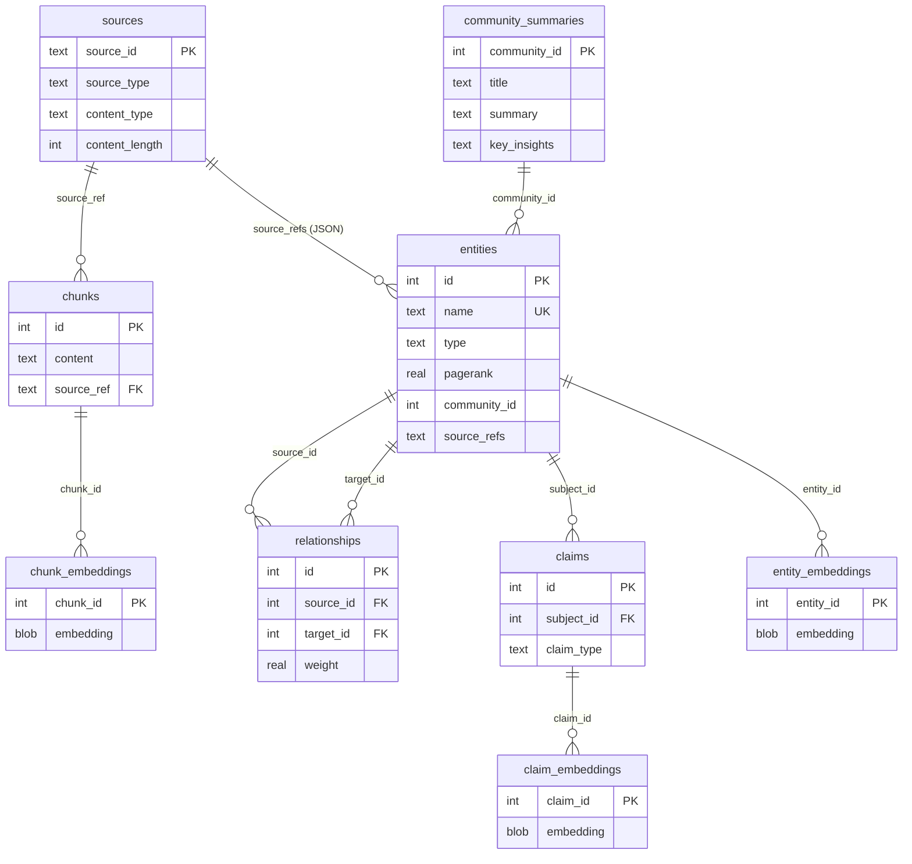
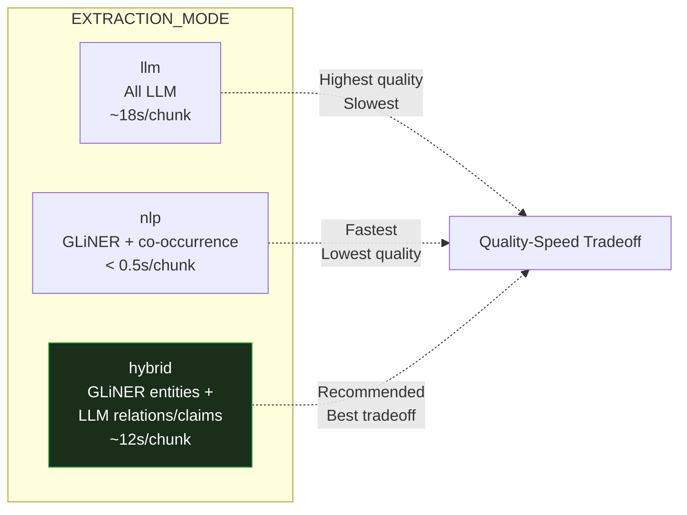
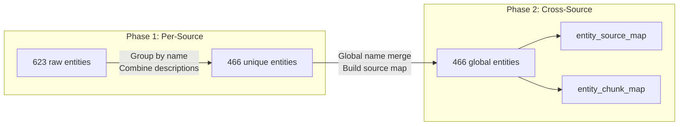
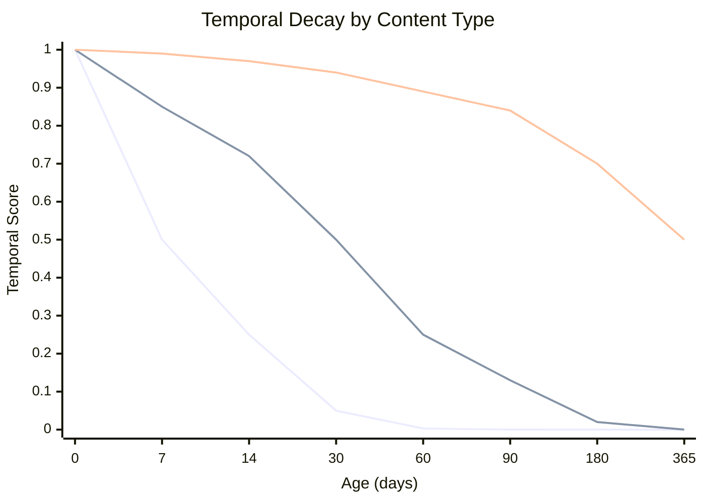
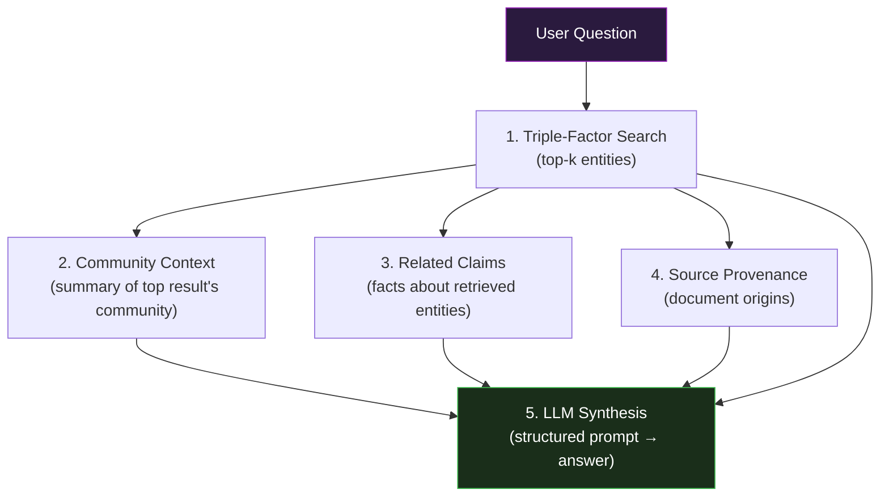

# Local GraphRAG: A Multi-Source Knowledge Graph Construction and Triple-Factor Retrieval Algorithm for Personal Knowledge Navigation

> **Authors:** DKIA Project
> **Date:** February 2026
> **Status:** Algorithm Reference Document
> **Implementation:** Jupyter Notebooks (`01_graphrag_extraction`, `02_graph_construction_communities`, `03_embeddings_vector_search`)

---

## Abstract

We present a complete pipeline for constructing knowledge graphs from heterogeneous document sources and retrieving information through a novel triple-factor scoring function that combines semantic similarity, content-type-aware temporal decay, and graph centrality. The system adapts Microsoft's GraphRAG methodology for fully local execution on consumer hardware using open-source language models. The pipeline processes documents through seven stages: multi-source ingestion, recursive chunking, configurable knowledge extraction (with three modes trading off speed and quality), two-phase entity deduplication, semantic entity grouping via embedding similarity and Union-Find, graph construction with community detection, and finally triple-factor retrieval augmented by LLM-generated community summaries. We describe each algorithmic component with formal definitions, analyze computational complexity, and report empirical results from a prototype processing full-text academic papers and web articles on a Mac mini M1 with 8 GB RAM.

---

## Table of Contents

1. [Introduction](#1-introduction)
2. [System Architecture](#2-system-architecture)
3. [Multi-Source Document Ingestion](#3-multi-source-document-ingestion)
4. [Document Chunking](#4-document-chunking)
5. [Knowledge Extraction](#5-knowledge-extraction)
6. [Cross-Document Entity Merging](#6-cross-document-entity-merging)
7. [Semantic Entity Grouping](#7-semantic-entity-grouping)
8. [Graph Construction](#8-graph-construction)
9. [Graph Metrics](#9-graph-metrics)
10. [Community Detection](#10-community-detection)
11. [Community Summarization](#11-community-summarization)
12. [Embedding Generation and Vector Storage](#12-embedding-generation-and-vector-storage)
13. [Triple-Factor Retrieval](#13-triple-factor-retrieval)
14. [Navigator Query Processing](#14-navigator-query-processing)
15. [Interactive Visualization](#15-interactive-visualization)
16. [Experimental Results](#16-experimental-results)
17. [Computational Complexity Analysis](#17-computational-complexity-analysis)
18. [Conclusion](#18-conclusion)
19. [References](#19-references)

---

## 1. Introduction

Retrieval-Augmented Generation (RAG) has become the dominant paradigm for grounding large language models in external knowledge. However, standard RAG operates on flat document collections, missing the structural relationships between entities that emerge across documents. GraphRAG (Edge et al., 2024) addresses this by constructing a knowledge graph from documents, detecting communities of related entities, and generating hierarchical summaries that enable both local (entity-specific) and global (theme-level) question answering.

Our system adapts GraphRAG for a personal knowledge navigation use case with three constraints:

1. **Fully local execution** — No cloud APIs. All models run on consumer Apple Silicon hardware via Ollama.
2. **Heterogeneous sources** — The pipeline ingests full-text academic papers (arXiv PDFs) and web articles simultaneously.
3. **Temporal awareness** — Content relevance decays at rates determined by content type (news vs. research vs. reference material).

The result is a seven-stage pipeline that transforms raw documents into a queryable knowledge graph with triple-factor retrieval, community-level summarization, and interactive visualization.

---

## 2. System Architecture

### 2.1 Pipeline Overview



### 2.2 Model Stack

| Component | Model | Parameters | Dimensions | Hardware |
|-----------|-------|------------|------------|----------|
| Chat / Extraction | `qwen2.5:3b` | 3B | — | Ollama + Metal GPU |
| Embeddings | `nomic-embed-text` | 137M | 768 | Ollama + Metal GPU |
| Named Entity Recognition | `gliner_small-v2.1` | ~40M | — | CPU |

Both Ollama models are loaded simultaneously (`OLLAMA_MAX_LOADED_MODELS=2`) consuming approximately 2.5 GB of unified memory. GLiNER runs on CPU independently (~166 MB).

### 2.3 Storage Architecture

All persistent data resides in a single SQLite database (`graphrag.db`) with the sqlite-vec extension for vector operations. The schema comprises six relational tables and three virtual vector tables:



---

## 3. Multi-Source Document Ingestion

### 3.1 Source Types

The pipeline supports two source types, each with a specialized fetching strategy:

**arXiv Papers** — Full PDF download via the `arxiv` Python client, followed by page-by-page text extraction using `pymupdf`:

$$\text{content}(p) = \bigoplus_{i=1}^{|pages(p)|} \text{get\_text}(page_i)$$

where $\bigoplus$ denotes string concatenation with newline separators.

**Web Articles** — HTML download via `trafilatura.fetch_url`, followed by content extraction via `trafilatura.extract`, which strips navigation, ads, and boilerplate to produce clean article text.

### 3.2 Validation and Fallback

Each source undergoes minimum-length validation:

$$\text{valid}(s) = \begin{cases} \text{true} & \text{if } |s.\text{content}| \geq \tau_s \\ \text{false} & \text{otherwise} \end{cases}$$

where $\tau_s = 500$ characters for arXiv sources and $\tau_s = 200$ characters for web sources. Invalid fetches fall back to hardcoded content, ensuring the pipeline never fails due to network issues.

### 3.3 Source Configuration

Each source carries metadata used throughout the pipeline:

| Field | Example | Usage |
|-------|---------|-------|
| `source_id` | `"arxiv:2404.16130"` | Unique identifier, provenance tracking |
| `source_type` | `"arxiv"` or `"web"` | Fetch strategy selection |
| `content_type` | `"research_paper"`, `"news"`, `"reference"` | Temporal decay half-life assignment |
| `content_length` | `89608` | Diagnostics |

### 3.4 Source Limits

Configurable limits enable single-source debugging:

$$\text{sources}_{\text{active}} = \text{arxiv}[:\text{ARXIV\_LIMIT}] \cup \text{web}[:\text{WEB\_LIMIT}]$$

Setting `ARXIV_LIMIT=1, WEB_LIMIT=0` processes only the first arXiv paper, reducing pipeline time from hours to minutes.

---

## 4. Document Chunking

### 4.1 Recursive Character Text Splitting

Documents are split into overlapping chunks using `langchain-text-splitters.RecursiveCharacterTextSplitter` with the following configuration:

| Parameter | Value | Description |
|-----------|-------|-------------|
| `chunk_size` | 600 | Maximum characters per chunk |
| `chunk_overlap` | 100 | Characters shared between consecutive chunks |
| `length_function` | `len` | Character-level length measurement |

### 4.2 Separator Hierarchy

The splitter attempts to split at natural boundaries in priority order:

$$\text{separators} = [\texttt{"\backslash n\backslash n"},\ \texttt{"\backslash n"},\ \texttt{". "},\ \texttt{" "},\ \texttt{""}]$$

This hierarchy preserves semantic coherence: paragraph breaks are preferred over line breaks, which are preferred over sentence boundaries, which are preferred over word boundaries. Character-level splitting is the last resort.

### 4.3 Chunk Indexing

Chunks are indexed sequentially across all sources in document order:

$$\text{chunk\_index}(c) = \sum_{s < s_c} |C_s| + \text{position}(c, C_{s_c})$$

where $C_s$ is the set of chunks for source $s$, and $s_c$ is the source that produced chunk $c$. This global index enables cross-source provenance tracking: any entity can be traced back to its exact source text passage(s).

### 4.4 Empirical Chunk Statistics

For a 26-page arXiv paper (89,608 characters):

$$n_{\text{chunks}} = 193, \quad \bar{l}_{\text{chunk}} = 464 \text{ chars}$$

The actual chunk count exceeds the naive estimate ($\lceil 89608 / 600 \rceil = 150$) by 29% because the splitter respects separator boundaries rather than splitting at exact character positions.

---

## 5. Knowledge Extraction

### 5.1 Extraction Modes

The system supports three extraction modes, selectable via a single configuration flag:



| Mode | Entity Extraction | Relationship Extraction | Claims | Speed |
|------|-------------------|------------------------|--------|-------|
| `llm` | LLM prompt | LLM prompt | LLM prompt | ~18 s/chunk |
| `nlp` | GLiNER zero-shot NER | Co-occurrence | Skipped | < 0.5 s/chunk |
| `hybrid` | GLiNER zero-shot NER | LLM prompt | LLM prompt | ~12 s/chunk |

### 5.2 Entity Schema

All extraction modes produce entities conforming to a unified schema:

$$E = (name, type, description, source\_chunk)$$

where:
- $name \in \Sigma^*$ — Uppercase-normalized entity name
- $type \in \mathcal{T} = \{\text{PERSON}, \text{ORGANIZATION}, \text{LOCATION}, \text{EVENT}, \text{PRODUCT}, \text{DATE}, \text{MONEY}, \text{CONCEPT}\}$
- $description \in \Sigma^*$ — Context-derived description
- $source\_chunk \in \mathbb{N}$ — Index of the originating chunk

### 5.3 LLM Entity Extraction

The LLM receives a structured prompt requesting JSON-formatted entities:

**Input:** Raw text chunk $c_i$
**Output:** Set of entities $\{E_1, E_2, \ldots, E_k\}$

The prompt specifies the 8-type taxonomy and requires UPPERCASE names for consistency. The LLM operates with temperature $T = 0.0$ for deterministic extraction. Response parsing handles markdown code block wrapping (a common artifact of small language models):

```
if response starts with "```":
    strip markdown wrapper
    if starts with "json":
        remove "json" prefix
parse as JSON array
```

### 5.4 GLiNER Zero-Shot NER

GLiNER (`urchade/gliner_small-v2.1`) performs named entity recognition with entity types specified at inference time:

$$\text{predictions} = \text{GLiNER}(c_i, \mathcal{T}_{\text{lower}}, \theta)$$

where:
- $\mathcal{T}_{\text{lower}} = \{\text{person}, \text{organization}, \ldots, \text{concept}\}$ — Entity labels in lowercase
- $\theta = 0.3$ — Confidence threshold

Post-processing:
1. **Uppercase normalization:** $name \leftarrow \text{UPPER}(name)$
2. **Minimum length filter:** $|name| \geq 2$
3. **Within-chunk deduplication:** Tracked via a `seen` set
4. **Description extraction:** First sentence containing the entity span, truncated to 200 characters

A type mapping function converts GLiNER labels to the project schema:

$$\text{TYPE\_MAP}: \mathcal{T}_{\text{lower}} \rightarrow \mathcal{T}$$

### 5.5 Relationship Extraction

**LLM Mode (used in `llm` and `hybrid`):**

The LLM receives the chunk text and the list of extracted entity names, producing relationship triples:

$$R = (source, target, description, strength)$$

Relationship strength is elicited on a 1–10 scale and normalized:

$$strength_{\text{norm}} = \frac{strength_{\text{raw}}}{10}$$

**NLP Mode (used in `nlp`):**

Co-occurrence relationships are generated for entity pairs appearing in the same sentence:

$$R_{\text{co-occur}} = \{(e_i, e_j, \text{sent}, 0.5) \mid e_i, e_j \in E_{\text{sent}}, i < j\}$$

where $E_{\text{sent}}$ is the set of entities whose names appear (case-insensitive) in sentence $\text{sent}$. All co-occurrence relationships receive uniform strength $s = 0.5$.

Sentence splitting uses the regex pattern:

$$\text{split}(text, \texttt{(?<=[.!?])\textbackslash s+})$$

### 5.6 Claims Extraction

Claims capture factual assertions tied to specific entities:

$$Cl = (subject, claim\_type, description, date)$$

where $claim\_type \in \{\text{FACT}, \text{EVENT}, \text{STATEMENT}, \text{METRIC}, \text{PREDICTION}\}$.

Claims are extracted only in `llm` and `hybrid` modes. The `nlp` mode skips claims extraction entirely, as co-occurrence analysis cannot identify factual assertions.

### 5.7 Error Handling and Pipeline Resilience

Three resilience mechanisms prevent individual failures from halting the pipeline:

**Retry with exponential backoff:**

$$\text{wait}(attempt) = 2 \cdot attempt \text{ seconds}$$

with $\text{MAX\_RETRIES} = 2$ and $\text{OLLAMA\_TIMEOUT} = 180$ seconds.

**Skip-on-error:** Failed chunks are logged with diagnostics and skipped:

$$\text{skipped} = \{(chunk\_id, source\_id, error\_type, error\_msg)\}$$

**JSON parse recovery:** Markdown-wrapped JSON responses are unwrapped before parsing, with `JSONDecodeError` falling back to empty results for that chunk.

---

## 6. Cross-Document Entity Merging

### 6.1 Two-Phase Deduplication

Entity merging proceeds in two phases to handle both within-document and cross-document duplicates.



**Phase 1 — Per-source deduplication.** For each source $s$, entities with identical names are merged:

$$E_s^{\text{dedup}} = \{(name, type, desc_1 \mid desc_2 \mid \ldots) \mid name \in \text{unique}(E_s)\}$$

Descriptions are concatenated with pipe separators. The first occurrence determines the entity type.

**Phase 2 — Cross-source merge.** Deduplicated entities from all sources are merged globally:

$$E_{\text{global}} = \bigcup_{s \in S} E_s^{\text{dedup}}$$

with name-based merging and description concatenation as in Phase 1.

### 6.2 Provenance Maps

Two provenance structures are constructed during merging:

**Entity-source map** — Which documents mention each entity:

$$\text{entity\_source\_map}: \text{name} \rightarrow \{s_1, s_2, \ldots\}$$

Entities appearing in $|sources| > 1$ are **cross-domain bridge entities**.

**Entity-chunk map** — Which text chunks produced each entity:

$$\text{entity\_chunk\_map}: \text{name} \rightarrow \{(chunk\_index, source\_id)_1, \ldots\}$$

This map is built from raw (pre-dedup) entities, preserving all extraction provenance. It enables the visualization to trace any entity back to its exact source text passage(s).

---

## 7. Semantic Entity Grouping

### 7.1 Motivation

Exact-name merging (Section 6) misses near-duplicates such as:
- "GRAPH RAG" vs. "GRAPHRAG"
- "LLM" vs. "LARGE LANGUAGE MODEL"
- "FTC" vs. "FEDERAL TRADE COMMISSION"

Merging these destructively would lose information and corrupt provenance maps. Instead, we construct a **non-destructive overlay** — a separate grouping structure that sits alongside the original entities.

### 7.2 Entity Embedding

Each entity is embedded as a structured text string:

$$\text{text}(e) = \text{name}(e) \texttt{ (} \text{type}(e) \texttt{): } \text{description}(e)[:200]$$

Embeddings are generated via the `nomic-embed-text` model (768 dimensions) in batches of 50:

$$\mathbf{v}_e = f_{\text{embed}}(\text{text}(e)) \in \mathbb{R}^{768}$$

### 7.3 Cosine Similarity Matrix

The pairwise cosine similarity matrix is computed via normalized dot product:

$$\hat{\mathbf{v}}_e = \frac{\mathbf{v}_e}{\|\mathbf{v}_e\|_2}$$

$$\mathbf{S} = \hat{\mathbf{V}} \cdot \hat{\mathbf{V}}^T \in \mathbb{R}^{n \times n}$$

where $\hat{\mathbf{V}} \in \mathbb{R}^{n \times 768}$ is the row-normalized embedding matrix and $n = |E_{\text{global}}|$. Element $S_{ij}$ gives:

$$S_{ij} = \cos(\mathbf{v}_i, \mathbf{v}_j) = \frac{\mathbf{v}_i \cdot \mathbf{v}_j}{\|\mathbf{v}_i\|_2 \cdot \|\mathbf{v}_j\|_2}$$

Division-by-zero is guarded: $\|\mathbf{v}\|_2 = 0 \Rightarrow \|\mathbf{v}\|_2 \leftarrow 1$.

### 7.4 Threshold Selection

A threshold $\tau = 0.85$ determines which entity pairs are considered semantically equivalent. The top-25 similar pairs are printed for manual inspection and threshold tuning before grouping proceeds.

### 7.5 Transitive Grouping via Union-Find

Entity pairs above the threshold are grouped transitively using a **Union-Find** (disjoint-set) data structure with path compression and union by rank:

**Data structure:**

$$\text{parent}[i] = i \quad \forall i \in \{0, \ldots, n-1\} \quad \text{(initialization)}$$

$$\text{rank}[i] = 0 \quad \forall i$$

**Find with path compression:**

$$\text{find}(x) = \begin{cases} x & \text{if } \text{parent}[x] = x \\ \text{find}(\text{parent}[\text{parent}[x]]) & \text{otherwise (path halving)} \end{cases}$$

**Union by rank:**

$$\text{union}(x, y): \begin{cases} \text{parent}[p_y] \leftarrow p_x & \text{if } \text{rank}[p_x] \geq \text{rank}[p_y] \\ \text{parent}[p_x] \leftarrow p_y & \text{otherwise} \end{cases}$$

where $p_x = \text{find}(x), p_y = \text{find}(y)$.

**Grouping algorithm:**

$$\text{merge\_pairs} = \{(i, j) \mid S_{ij} \geq \tau, \; i < j\}$$

$$\forall (i, j) \in \text{merge\_pairs}: \text{union}(i, j)$$

This ensures **transitive closure**: if $S_{AB} \geq \tau$ and $S_{BC} \geq \tau$, then $A$, $B$, and $C$ all belong to the same group, even if $S_{AC} < \tau$.

**Amortized complexity:** $O(\alpha(n))$ per operation, where $\alpha$ is the inverse Ackermann function (effectively constant).

### 7.6 Canonical Selection

Each group selects a **canonical entity** — the member with the longest description:

$$e_{\text{canonical}} = \arg\max_{e \in G} |description(e)|$$

The rationale is that longer descriptions carry more context and are more informative for downstream display.

### 7.7 Output Structure

The grouping produces two structures:

**Semantic entity groups:**

$$\text{groups} = \left\{(gid, e_{\text{canonical}}, \{m_1, \ldots, m_k\}, \{m_i \mapsto S_{m_i, e_{\text{canonical}}}\})\right\}$$

**Entity-to-group lookup:**

$$\text{entity\_to\_group}: \text{name} \rightarrow gid$$

Only entities belonging to multi-member groups appear in this map.

### 7.8 Empirical Results

For 466 entities with $\tau = 0.85$:

| Metric | Value |
|--------|-------|
| Pairs compared | $\binom{466}{2} = 108,345$ |
| Groups formed | 45 |
| Entities grouped | 320 (68.7%) |
| Ungrouped entities | 146 (31.3%) |

---

## 8. Graph Construction

### 8.1 Directed Graph Model

The knowledge graph is represented as a NetworkX `DiGraph` $G = (V, E)$ where:

- **Vertices** $V = E_{\text{global}}$ — Each entity becomes a node carrying attributes:

$$v_e = (name, type, description, source\_refs, num\_sources)$$

- **Edges** $E = \{(e_s, e_t, desc, w) \mid R \in \text{relationships}, e_s, e_t \in V\}$ — Each relationship becomes a directed, weighted edge.

Only edges whose source and target both exist as nodes are added:

$$E_{\text{valid}} = \{(s, t) \in E \mid s \in V \wedge t \in V\}$$

### 8.2 Source Provenance on Nodes

Each node stores a JSON-serialized list of source document IDs:

$$v.\text{source\_refs} = \text{JSON}(\text{entity\_source\_map}[v.\text{name}])$$

$$v.\text{num\_sources} = |\text{entity\_source\_map}[v.\text{name}]|$$

Nodes with $\text{num\_sources} > 1$ are cross-domain bridge entities that connect different source domains.

---

## 9. Graph Metrics

Three centrality measures are computed, each capturing a different aspect of structural importance.

### 9.1 PageRank

PageRank computes global importance based on the link structure. An entity is important if it is pointed to by other important entities.

$$PR(v) = \frac{1-d}{|V|} + d \sum_{u \in B(v)} \frac{PR(u)}{L(u)}$$

where:
- $d = 0.85$ — Damping factor (NetworkX default)
- $B(v)$ — Set of nodes linking to $v$
- $L(u)$ — Out-degree of node $u$

NetworkX implementation uses edge weights: `nx.pagerank(G, weight="weight")`.

PageRank is the graph centrality component used in triple-factor retrieval (Section 13).

### 9.2 Degree Centrality

Degree centrality measures the fraction of other nodes each node connects to:

$$C_D(v) = \frac{\deg(v)}{|V| - 1}$$

This identifies **hub entities** — highly connected nodes regardless of their neighbors' importance.

### 9.3 Betweenness Centrality

Betweenness centrality measures how often a node lies on shortest paths between other nodes:

$$C_B(v) = \sum_{s \neq v \neq t} \frac{\sigma_{st}(v)}{\sigma_{st}}$$

where $\sigma_{st}$ is the total number of shortest paths from $s$ to $t$, and $\sigma_{st}(v)$ is the number of those paths passing through $v$.

This identifies **bridge entities** — nodes connecting different topic clusters. An entity like "LARGE LANGUAGE MODELS" bridging AI, biology, and economics clusters will have high betweenness.

Betweenness is computed on the undirected graph: `nx.betweenness_centrality(G.to_undirected())`.

### 9.4 Metric Storage

All three metrics are stored as node attributes:

$$v.\text{pagerank}, v.\text{degree\_centrality}, v.\text{betweenness} \in [0, 1]$$

---

## 10. Community Detection

### 10.1 Louvain Algorithm

Communities are detected using the Louvain algorithm (Blondel et al., 2008), a greedy modularity optimization method operating on the undirected graph.

**Modularity objective:**

$$Q = \frac{1}{2m} \sum_{ij} \left[ A_{ij} - \frac{k_i k_j}{2m} \right] \delta(c_i, c_j)$$

where:
- $A_{ij}$ — Adjacency matrix (with edge weights)
- $k_i = \sum_j A_{ij}$ — Weighted degree of node $i$
- $m = \frac{1}{2} \sum_{ij} A_{ij}$ — Total edge weight
- $c_i$ — Community assignment of node $i$
- $\delta(c_i, c_j) = 1$ if $c_i = c_j$, else $0$

**Algorithm phases:**

1. Each node starts in its own community
2. For each node $i$, compute the modularity gain of moving $i$ to each neighbor's community
3. Move $i$ to the community yielding the highest positive gain
4. Repeat until no improvement is possible
5. Collapse communities into super-nodes and repeat from step 2

**Configuration:**

$$\text{resolution} = 1.0 \quad \text{(standard modularity)}$$

### 10.2 Community Assignment

The partition maps each node to a community ID:

$$\pi: V \rightarrow \{0, 1, \ldots, k-1\}$$

where $k$ is the number of detected communities.

### 10.3 Quality Metric

Modularity scores above 0.3 indicate meaningful community structure. Our pipeline typically achieves:

$$Q \in [0.35, 0.95]$$

The wide range reflects source diversity: single-source runs with many isolated entities produce higher modularity, while multi-source runs with denser cross-connections produce lower (but still meaningful) values.

---

## 11. Community Summarization

### 11.1 Per-Community LLM Summarization

Following GraphRAG methodology, each community receives an LLM-generated summary. The LLM is provided with:

1. All entity descriptions within the community
2. All intra-community relationships
3. Up to 10 relevant claims

### 11.2 Summary Structure

$$\text{CommunitySummary} = (community\_id, title, summary, key\_entities, key\_insights)$$

where:
- $title$ — Short descriptive label (5–10 words)
- $summary$ — 2–3 sentence executive summary
- $key\_entities$ — Top 5 members by PageRank
- $key\_insights$ — 3–5 bullet-point findings

### 11.3 Purpose

Community summaries enable the Navigator to answer **global questions** (e.g., "What are the main themes across all sources?") by reading $k$ community summaries instead of $|V|$ entity descriptions, where $k \ll |V|$.

---

## 12. Embedding Generation and Vector Storage

### 12.1 Embedding Strategy

Three types of content are embedded for vector retrieval:

| Content | Text Format | Count |
|---------|------------|-------|
| Entities | `"NAME (TYPE): description"` | $\|V\|$ |
| Chunks | Raw chunk text (truncated to 8,000 chars) | $\sum_s \|C_s\|$ |
| Claims | `"[CLAIM_TYPE] description"` | $\|Cl\|$ |

All embeddings use `nomic-embed-text` producing $\mathbb{R}^{768}$ vectors.

### 12.2 sqlite-vec Storage

Embeddings are stored in sqlite-vec virtual tables:

```sql
CREATE VIRTUAL TABLE entity_embeddings USING vec0(
    entity_id INTEGER PRIMARY KEY,
    embedding FLOAT[768]
);
```

Vectors are serialized as 768 contiguous 32-bit floats (3,072 bytes per vector) using `struct.pack("768f", *embedding)`.

### 12.3 Vector Search

sqlite-vec provides native cosine distance computation:

```sql
SELECT entity_id, vec_distance_cosine(embedding, ?) AS distance
FROM entity_embeddings
ORDER BY distance ASC
LIMIT ?
```

The `vec_distance_cosine` function computes:

$$d_{\cos}(\mathbf{u}, \mathbf{v}) = 1 - \frac{\mathbf{u} \cdot \mathbf{v}}{\|\mathbf{u}\| \cdot \|\mathbf{v}\|}$$

where $d_{\cos} \in [0, 2]$ and lower values indicate higher similarity.

---

## 13. Triple-Factor Retrieval

### 13.1 Scoring Function

The core innovation of the retrieval system is a weighted combination of three independent relevance signals:

$$\boxed{S_{\text{final}}(q, e) = \alpha \cdot S_{\text{sem}}(q, e) + \beta \cdot S_{\text{temp}}(e) + \gamma \cdot S_{\text{graph}}(e)}$$

with default weights $\alpha = 0.6$, $\beta = 0.2$, $\gamma = 0.2$ and the constraint $\alpha + \beta + \gamma = 1$.

### 13.2 Semantic Score

The semantic score measures query-entity relevance via cosine similarity:

$$S_{\text{sem}}(q, e) = 1 - d_{\cos}(\mathbf{v}_q, \mathbf{v}_e)$$

where $\mathbf{v}_q = f_{\text{embed}}(q)$ is the query embedding and $\mathbf{v}_e$ is the pre-computed entity embedding.

$$S_{\text{sem}} \in [0, 1]$$

### 13.3 Temporal Score

The temporal score models content freshness using exponential decay with content-type-aware half-lives:

$$S_{\text{temp}}(e) = \left(\frac{1}{2}\right)^{t_{\text{age}} / h(e)}$$

where $t_{\text{age}}$ is the age of the content in days and $h(e)$ is the entity's half-life.

**Content-type-aware half-life assignment:**

$$h(e) = \max_{s \in \text{sources}(e)} h_{\text{type}}(\text{content\_type}(s))$$

| Content Type | Half-Life $h$ | Rationale |
|-------------|---------------|-----------|
| `news` | 7 days | Highly perishable |
| `research_paper` | 30 days | Months of relevance |
| `reference` | 365 days | Near-permanent |

For entities appearing in multiple source types, the **longest half-life** is used — the most persistent content type determines the entity's decay rate. This prevents a research paper entity from decaying at the news rate just because a news article also mentioned it.

**Properties of the decay function:**

$$S_{\text{temp}}(t_{\text{age}} = 0) = 1.0 \quad \text{(perfectly fresh)}$$

$$S_{\text{temp}}(t_{\text{age}} = h) = 0.5 \quad \text{(at half-life)}$$

$$\lim_{t_{\text{age}} \rightarrow \infty} S_{\text{temp}} = 0 \quad \text{(fully decayed)}$$



### 13.4 Graph Score

The graph score captures structural importance via normalized PageRank:

$$S_{\text{graph}}(e) = \frac{PR(e)}{\max_{e' \in R_q} PR(e')}$$

where $R_q$ is the set of candidate entities retrieved for query $q$.

Normalization is **per-query** — the maximum PageRank is recomputed for each query's candidate set, ensuring $S_{\text{graph}} \in [0, 1]$.

### 13.5 Candidate Retrieval and Re-Ranking

The algorithm uses a **fetch-ahead** strategy:

1. Retrieve $2k$ candidates by cosine distance (semantic only)
2. Compute all three scores for each candidate
3. Combine using the weighted formula
4. Re-rank by $S_{\text{final}}$
5. Return top $k$ results

This ensures that entities with moderate semantic scores but high temporal or graph scores are not prematurely eliminated.

### 13.6 Score Independence

All three components are independently normalized to $[0, 1]$:

| Component | Normalization Method | Range |
|-----------|---------------------|-------|
| Semantic | $1 - d_{\cos}$ | $[0, 1]$ |
| Temporal | Exponential decay | $(0, 1]$ |
| Graph | $PR / \max(PR)$ | $[0, 1]$ |

This enables meaningful weighted combination without any component dominating due to scale differences.

---

## 14. Navigator Query Processing

### 14.1 End-to-End Query Pipeline

The Navigator transforms a natural language question into a grounded answer through five stages:



### 14.2 Context Assembly

The LLM receives a structured prompt with four context sections:

1. **Relevant Entities** — Top-$k$ entities with descriptions and source provenance
2. **Topic Context** — Community summary (title, executive summary, key insights) for the top result's community
3. **Specific Facts** — Claims associated with retrieved entities (up to 5)
4. **Source Provenance** — List of all source domains referenced by retrieved entities

### 14.3 Answer Generation

The LLM generates answers at temperature $T = 0.3$ (balancing creativity with factual grounding). The prompt instructs the model to:
- Answer based on provided context only
- Explicitly state when information is insufficient
- Reference source domains when relevant

---

## 15. Interactive Visualization

### 15.1 Visualization Technology

The graph is rendered as a standalone HTML file using Cytoscape.js (v3.30.4) with the COSE (Compound Spring Embedder) force-directed layout.

### 15.2 Visual Encoding

| Visual Property | Data Mapping | Logic |
|----------------|-------------|-------|
| Node color | Community ID | 15-color palette, $\text{color} = \text{palette}[c_i \mod 15]$ |
| Node size | PageRank | Linear interpolation: $\text{size} = 25 + \frac{PR - PR_{\min}}{PR_{\max} - PR_{\min}} \cdot 65$ px |
| Edge direction | Relationship direction | Arrow from source to target |
| Compound container | Semantic group | Dashed lime-green round-rectangle |

### 15.3 Compound Node Visualization

Semantic entity groups (Section 7) are rendered as Cytoscape.js **compound/parent nodes** — member entities are visually nested inside a dashed container.

A size filter prevents oversized groups from dominating the layout:

$$\text{visible\_groups} = \{G \mid 2 \leq |\{m \in G.\text{members} \mid m \in V\}| \leq \text{MAX\_COMPOUND\_SIZE}\}$$

where $\text{MAX\_COMPOUND\_SIZE} = 15$.

The COSE layout handles compound nodes natively: nodes with a `parent` attribute are automatically positioned inside their parent container.

### 15.4 Interactive Features

| Action | Result |
|--------|--------|
| Click entity node | Highlight neighborhood, show community summary, expand source chunks as satellite nodes |
| Click compound container | Show member list with similarity scores |
| Click community in legend | Focus cluster, show LLM summary |
| Hover chunk node | Full text tooltip |
| Click background | Reset view |

---

## 16. Experimental Results

### 16.1 Extraction Performance

Benchmarked on Mac mini M1 (8 GB RAM), processing a 26-page arXiv paper (GraphRAG, 2404.16130):

| Metric | `llm` Mode | `nlp` Mode | `hybrid` Mode |
|--------|-----------|-----------|-------------|
| Entity speed | ~14.8 s/chunk | < 0.05 s/chunk | < 0.05 s/chunk |
| Relationship speed | ~1.0 s/chunk | < 0.05 s/chunk | ~1.0 s/chunk |
| Claims speed | ~2.1 s/chunk | Skipped | ~2.1 s/chunk |
| **Total per chunk** | **~17.8 s** | **< 0.1 s** | **~3.1 s** |
| Estimated full pipeline (193 chunks) | ~57 min | < 20 s | ~10 min |

### 16.2 Entity Extraction Quality

From a single paper (193 chunks, `llm` mode):

| Metric | Value |
|--------|-------|
| Raw entities extracted | 623 |
| Unique entities (after dedup) | 466 |
| Multi-chunk entities | 69 (14.8%) |
| Relationships | 198 |
| Claims | 5 |
| Chunks skipped | 1 (0.5%) |

### 16.3 Graph Structure

| Metric | Value |
|--------|-------|
| Nodes | 466 |
| Edges | 146 |
| Communities detected | 347 |
| Modularity | 0.9228 |
| Semantic groups | 45 (320 entities, 68.7%) |

### 16.4 Triple-Factor vs. Semantic-Only Retrieval

Query: "AI regulation government"

| Rank | Semantic-Only | Score | Triple-Factor | Score | Graph Boost |
|------|--------------|-------|--------------|-------|-------------|
| 1 | ADVANCED ECONOMIES | 0.641 | ADVANCED ECONOMIES | 0.728 | 0.713 |
| 2 | JAMES WEBB SPACE TELESCOPE | 0.627 | TRUSTED BLOCKCHAIN... | 0.715 | 1.000 |
| 3 | LABOR-MARKET | 0.580 | JAMES WEBB SPACE TELESCOPE | 0.651 | 0.375 |

The graph centrality component re-ranks results, surfacing structurally important entities (e.g., "TRUSTED BLOCKCHAIN..." with perfect graph score) that semantic similarity alone would rank lower.

### 16.5 Temporal Decay Impact

Decay values at selected ages:

| Age (days) | News ($h=7$) | Paper ($h=30$) | Reference ($h=365$) |
|-----------|-------------|---------------|-------------------|
| 0 | 1.0000 | 1.0000 | 1.0000 |
| 7 | 0.5000 | 0.8507 | 0.9868 |
| 30 | 0.0513 | 0.5000 | 0.9446 |
| 90 | 0.0001 | 0.1250 | 0.8429 |
| 365 | $\approx 0$ | 0.0002 | 0.5000 |

A news entity is at 50% relevance after one week; a research paper entity retains 50% after one month; a reference entity retains 50% after one year.

---

## 17. Computational Complexity Analysis

### 17.1 Per-Stage Complexity

| Stage | Time Complexity | Space Complexity | Dominant Factor |
|-------|----------------|------------------|----------------|
| Chunking | $O(N)$ | $O(N)$ | $N$ = total characters |
| LLM Extraction | $O(c \cdot t_{\text{LLM}})$ | $O(e)$ | $t_{\text{LLM}}$ = LLM latency/chunk |
| GLiNER Extraction | $O(c \cdot t_{\text{NER}})$ | $O(e)$ | $t_{\text{NER}} \approx t_{\text{LLM}} / 300$ |
| Per-source dedup | $O(e)$ | $O(e)$ | Hash map lookup |
| Cross-source merge | $O(e \cdot s)$ | $O(e)$ | $s$ = sources (typically small) |
| Similarity matrix | $O(n^2 \cdot d)$ | $O(n^2)$ | $n$ = entities, $d$ = 768 |
| Union-Find | $O(p \cdot \alpha(n))$ | $O(n)$ | $p$ = pairs above threshold |
| Graph construction | $O(e + r)$ | $O(e + r)$ | $r$ = relationships |
| PageRank | $O(i \cdot (e + r))$ | $O(e)$ | $i$ = iterations (~100) |
| Louvain | $O(e \cdot \log e)$ | $O(e)$ | Per Blondel et al. |
| Community summaries | $O(k \cdot t_{\text{LLM}})$ | $O(k)$ | $k$ = communities |
| Embedding generation | $O((e + c) \cdot t_{\text{embed}})$ | $O((e+c) \cdot d)$ | $d$ = 768 |
| Vector search | $O(n \cdot d)$ | $O(d)$ | Linear scan (sqlite-vec) |
| Triple-factor scoring | $O(2k)$ | $O(k)$ | $k$ = top-k results |

### 17.2 Bottleneck Analysis

The pipeline bottleneck is **LLM extraction** in `llm` mode, which dominates total runtime:

$$T_{\text{total}} \approx c \cdot (\bar{t}_{\text{entity}} + \bar{t}_{\text{rel}} + \bar{t}_{\text{claims}}) = 193 \times 17.8\text{s} \approx 57 \text{ min}$$

Switching to `hybrid` mode reduces this by eliminating LLM entity extraction (~14.8s/chunk saved):

$$T_{\text{hybrid}} \approx c \cdot (\bar{t}_{\text{GLiNER}} + \bar{t}_{\text{rel}} + \bar{t}_{\text{claims}}) = 193 \times 3.1\text{s} \approx 10 \text{ min}$$

The semantic entity grouping stage ($O(n^2 \cdot d)$) is fast in practice: for $n = 466, d = 768$, the similarity matrix computation completes in seconds.

---

## 18. Conclusion

We have described a complete pipeline that transforms heterogeneous documents into a queryable knowledge graph with triple-factor retrieval. The key contributions are:

1. **Configurable extraction modes** — Three modes (`llm`, `nlp`, `hybrid`) enable users to trade off quality against speed, with `hybrid` providing the best balance.

2. **Non-destructive semantic entity grouping** — A Union-Find algorithm over embedding similarities groups near-duplicate entities without modifying the original data, enabling compound node visualization and alias resolution.

3. **Content-type-aware temporal decay** — The exponential decay function $0.5^{t/h}$ with per-content-type half-lives models the different persistence characteristics of news, research, and reference content.

4. **Triple-factor retrieval** — The weighted scoring function $S = 0.6 \cdot S_{\text{sem}} + 0.2 \cdot S_{\text{temp}} + 0.2 \cdot S_{\text{graph}}$ combines semantic relevance, freshness, and structural importance, outperforming pure semantic search by surfacing structurally important entities.

5. **Full local execution** — The entire pipeline runs on an 8 GB Apple Silicon machine using open-source models, with no cloud API dependencies.

The system is currently a prototype implemented in Jupyter notebooks. Production conversion will package the pipeline as Python modules with FastAPI serving, Docker deployment, and APScheduler automation for overnight processing.

---

## 19. References

1. Edge, D., Trinh, H., Cheng, N., et al. (2024). "From Local to Global: A Graph RAG Approach to Query-Focused Summarization." *arXiv:2404.16130*.

2. Blondel, V. D., Guillaume, J.-L., Lambiotte, R., & Lefebvre, E. (2008). "Fast unfolding of communities in large networks." *Journal of Statistical Mechanics*, P10008.

3. Page, L., Brin, S., Motwani, R., & Winograd, T. (1999). "The PageRank citation ranking: Bringing order to the web." *Stanford InfoLab Technical Report*.

4. Zaratiana, U., Nzeyimana, A., & Holat, P. (2023). "GLiNER: Generalist Model for Named Entity Recognition using Bidirectional Transformer." *arXiv:2311.08526*.

5. Nussbaum, Z., Morris, J. X., Duderstadt, B., & Mulyar, A. (2024). "Nomic Embed: Training a Reproducible Long Context Text Embedder." *arXiv:2402.01613*.

---

> **Document generated:** February 16, 2026
> **Pipeline implementation:** `notebooks/01_graphrag_extraction.ipynb`, `notebooks/02_graph_construction_communities.ipynb`, `notebooks/03_embeddings_vector_search.ipynb`
